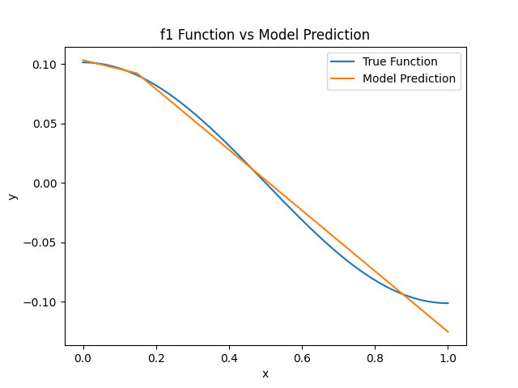
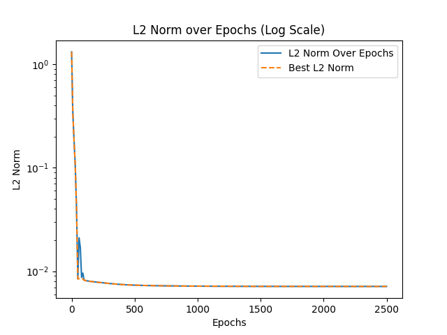
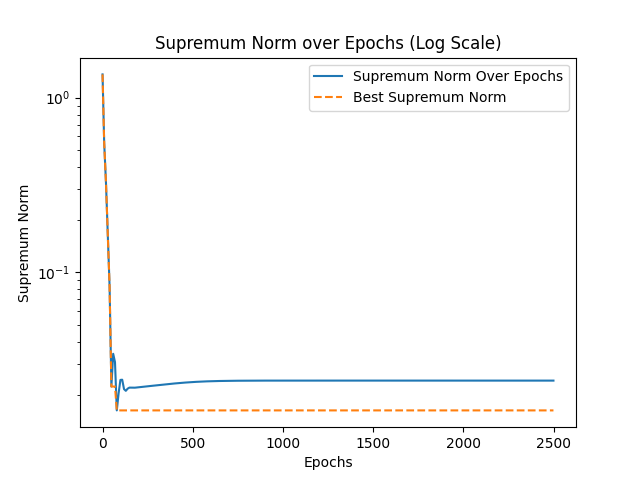
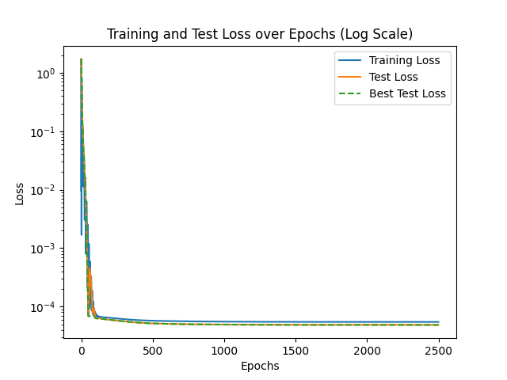
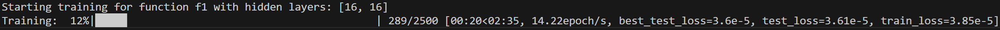
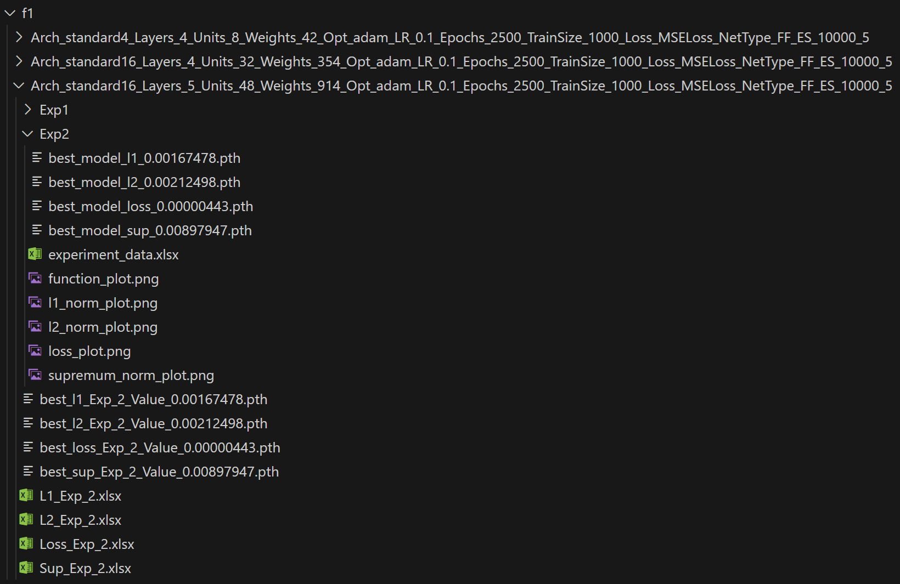

# Neural Network Complexity and Approximation Accuracy

This repository contains the code and resources used for numerical experiments conducted as part of my Bachelor's thesis. The project explores how neural network architecture complexity influences approximation accuracy when modeling mathematical functions.

---

## Table of Contents

- **[Background](#background)**  
- **[Features](#features)**  
- **[Dependencies](#dependencies)**  
- **[Function Details](#function-details)**  
  - [Functions `f1` to `f6`](#functions-f1-to-f6)  
  - [Architectures](#architectures)  
  - [Utility Functions](#utility-functions)  
  - [Core Function: `run_experiment`](#core-function-run_experiment)  
- **[Usage](#usage)**  
  - [Experiment Setup](#experiment-setup)  
- **[Example Results](#example-results)**  
  - [Visualization (2x2 Grid)](#visualization-2x2-grid)  
  - [Terminal Output](#terminal-output)  
  - [Generated Folder Structure](#generated-folder-structure)  
- **[Thesis and References](#thesis-and-references)**  
- **[Acknowledgments](#acknowledgments)**  

---

## Background

This project explores the interplay between neural network architecture and its ability to approximate mathematical functions with a given level of accuracy. Building on theoretical results, such as theorems that establish upper bounds on the number of weights and layers required for a given approximation accuracy, the goal is to investigate these relationships empirically. The theoretical framework suggests that the architectural complexity of a neural network—such as the depth, width, and total number of weights—depends on the accuracy and the function class of the target function.

Using this code, different functions are approximated with neural networks of varying architectures, and the primary focus is on analyzing how the architectural complexity affects the achieved accuracy. Specifically, the experiments examine how many layers, neurons, and weights are "needed" to reach a certain error threshold in different norms (e.g., L1, L2, supremum). 

It is important to note that this is not a comprehensive study. Neural network training in practice does not always achieve the theoretical global minimum of the loss or error norms, and results are influenced by factors such as optimization and initialization. However, this project provides practical insights into how architectural choices influence performance and complexity, complementing the theoretical results.

The work is inspired by the foundational results of Petersen & Voigtlaender (2018) and Yarotsky (2017), and serves as an empirical extension of the theoretical framework established in these papers and my Bachelor's thesis.

**Note:**  
This code was originally written for personal use to support my thesis. While it is functional and produces reliable results, it might not be the cleanest or most efficient. My priority was to generate as much data as possible for analysis rather than optimizing the implementation.

---

## Features

- **Custom Neural Network Architectures**  
  Generate architectures with specific patterns: standard width, increasing/decreasing triangular widths, diamond, and sandglass shapes.  

- **Function Approximations**  
  Approximate a variety of mathematical functions (`f1` to `f6`) using feedforward or multilayer perceptron (MLP) architectures.  

- **Experimentation and Evaluation**  
  Conduct training and evaluation experiments, track performance metrics, and visualize results.  

- **Visualization**  
  Generate loss curves, approximation accuracy plots, and optional animations of training progress (requires `ffmpeg`).

---

## Dependencies

The following libraries are necessary for running the code:

- `torch`  
- `numpy`  
- `matplotlib`  
- `openpyxl`  
- `tqdm`  
- `ffmpeg` (only required if animations are enabled)

---

## Function Details

### Functions `f1` to `f6`

The following mathematical functions are approximated in this project:

- **`f1(x)`**: f₁(x) = cos(πx) / π²  
- **`f2(x)`**: f₂(x) = |x|^(3/2)  
- **`f3(x₁, x₂)`**: f₃(x₁, x₂) is defined as:
  - **1** if \( x₁ + |x₂|^{3/2} >= 0 \)  
  - **0** otherwise
- **`f4(x)`**: f₄(x) = |x|^(7/2)  
- **`f5(x)`**: f₅(x) = x²  
- **`f6(x)`**: f₆(x) = cos(2πx)

### Architectures

#### `standard_architecture(depth, width)`
Creates a network where all layers have the same width.  
**Example**:  
For `depth=3` and `width=8`, the architecture is `[8, 8, 8]` with name `standard8`.

#### `increasing_architecture(depth, width)`
Creates a triangular architecture with increasing layer widths.  
**Example**:  
For `depth=3` and `width=8`, the architecture is `[8, 16, 24]` with name `increasing8`.

#### `decreasing_architecture(depth, width)`
Creates a triangular architecture with decreasing layer widths.  
**Example**:  
For `depth=3` and `width=8`, the architecture is `[24, 16, 8]` with name `decreasing8`.

#### `diamond_architecture(depth, width)`
Creates a symmetric architecture where widths increase and then decrease.  
**Example**:  
For `depth=5` and `width=8`, the architecture is `[8, 16, 32, 16, 8]` with name `diamond8`.

#### `sandglass_architecture(depth, width)`
Creates a symmetric architecture where widths decrease to a minimum and then increase.  
**Example**:  
For `depth=5` and `width=8`, the architecture is `[32, 16, 8, 16, 32]` with name `sandglass8`.

### Utility Functions

#### `calculate_weights(layers, allow_non_adjacent)`
Calculates the total number of weights (parameters) in a network based on its layer structure and whether the network is a Multilayer Perceptron or a Feedforward Network.  

### Core Function: `run_experiment`

This function trains and evaluates a neural network based on a given architecture and configuration.

#### Arguments
- **`hidden_layers`**: List specifying the number of neurons in each hidden layer.
- **`epochs`**: Number of training epochs.
- **`train_size`**: Number of training samples.
- **`test_size`**: Number of testing samples.
- **`lr`**: Learning rate.
- **`optimizer_type`**: Optimization algorithm, either `"adam"` or `"sgd"`.
- **`device`**: `"cpu"` or `"cuda"` for computation.
- **`function`**: Function to approximate (`f1` to `f6`).
- **`num_experiments`**: Number of independent runs for each configuration.
- **`network_type`**: `"MLP"` for a multilayer perceptron or `"FF"` for a feedforward network.
- **`architecture`**: A descriptive name for the network architecture.
- **`early_stopping`**: Tuple specifying stopping criteria: (`window_size`, `threshold`).
- **`animation`**: If `True`, generates an animation of the training process (requires `ffmpeg`).

#### What It Does
1. **Data Generation**: Creates training and testing datasets for the specified function.  
2. **Model Training**: Initializes and trains a neural network using the specified architecture and parameters.  
3. **Performance Evaluation**: Tracks key metrics, including L1/L2 norms and supremum error.  

#### Output and Folder Structure
For each configuration, the following outputs are created and saved in a dedicated folder:
- **Training and Testing Logs**: `.xlsx` files containing detailed training and testing metrics (e.g., loss values, norms, best models).  
- **Visualization**: Plots of the function approximations compared to the true function, and optionally, training animations if enabled.  
- **Best Models**: The best-performing model for each norm (L1, L2, supremum) and the best test loss are saved as `.pth` files.  

Additionally, a **global summary file** (`experiment_summary.xlsx`) is maintained at the root level of the experiment directory. This file aggregates the most important results from all configurations into one table, with one row per configuration. Key details include:
- Architecture information
- Training/test performance metrics
- Best norm values achieved
- Non-zero weights and training times for each norm.

---

## Usage

### Experiment Setup

1. **Set Parameters**: Adjust settings such as `epochs`, `train_size`, `lr`, and `function` in your script.  
2. **Define Architectures**: Use the provided architecture functions (e.g., `standard_architecture`) to create network configurations.  
3. **Run Experiments**: Call `run_experiment` to train and evaluate the models.

---

## Example Results

### Visualization (2x2 Grid)

Below are sample visualizations generated during training:

|  |  |
|---------------------------------------------------|-------------------------------------|
| **True Function vs Model Prediction**            | **L2 Norm over Epochs (Log Scale)** |

|         |  |
|---------------------------------------------------|------------------------------------------|
| **Supremum Norm over Epochs (Log Scale)**         | **Training Loss over Epochs**            |

### Terminal Output

Below is an example of the terminal output during a training run:

### Generated Folder Structure

The folder structure for storing results is shown below:

---

## Thesis and References

The numerical experiments are detailed in my Bachelor’s thesis:  
- **[Bachelor Thesis (PDF)](./Bachelor_Thesis.pdf)**  

### Key References
- Petersen, P., & Voigtlaender, F. (2018). *Optimal approximation of piecewise smooth functions using deep ReLU neural networks*. [arXiv:1709.05289](https://arxiv.org/abs/1709.05289)  
- Yarotsky, D. (2017). *Error bounds for approximations with deep ReLU networks*. [arXiv:1610.01145](https://arxiv.org/abs/1610.01145)

---

## Acknowledgments

Special thanks to:  
- My supervisor Prof. Dr. Andrea Barth for her guidance and support.  
- The authors of the referenced papers for their foundational work.  
- Open-source libraries and tools that made this project possible.  
